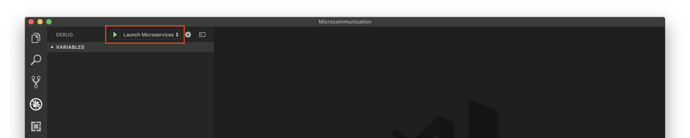

# Micro-Services Communication Demo

This is a small demo project to quickly setup a mix of containerized micro-services that communicate with each other within the network. This demo is intended to provide a playground for orchestrators!

Currently, it consists of

- An API Backend, that exposes port `8080`
- A Web Frontend, that exposes port `80`
    - Connects to the API Backend for getting random numbers using the `RandomApiHost` environment variable

## Make it run

### Prerequisites

- [.NET Core 2 SDK](https://dotnet.microsoft.com/download)
- [Docker](https://www.docker.com/products/docker-desktop)

The easiest way to run and debug the microservices on you development machine is [Visual Studio Code](). Just open the folder and select the *Launch Microservices* Debug configuration.



### Orchestrators

This Demo project is intendet to be tested within a container orchestrators. As there are various different orchestrators out there, you can find configuration files for multiple different ones in the repository.

#### Docker Compose

```bash
docker build -t "microcommunication-api:latest" MicroCommunication.Api/
docker build -t "microcommunication-web:latest" MicroCommunication.Web/
```

```bash
docker-compose -f docker-compose.yml up
```

#### Kubernetes

```bash
kubectl create -f kubernetes.yml
```

#### Service Fabric Mesh

```bash
az mesh deployment create --resource-group Demo --template-file servicefabric-mesh.json
```
