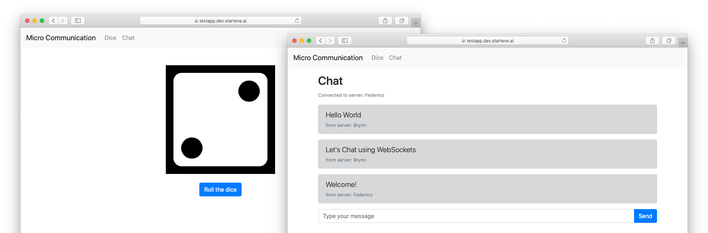

# Micro-service Intercommunication Demo

[](https://hub.docker.com/r/robinmanuelthiel/microcommunication-api/) [](https://hub.docker.com/r/robinmanuelthiel/microcommunication-web/)
[](https://dev.azure.com/robinmanuelthiel/Microcommunication/_build/latest?definitionId=9&branchName=master)

This is a small demo project to quickly setup a mix of containerized micro-services that communicate with each other within the network. This demo is intended to provide a playground for orchestrators!

The project consists of

- An API Backend, written in .NET Core, exposes port `8080`
- A Web Frontend, written in .NET Core, exposes port `80`

## Make it run

### Prerequisites

- [.NET Core 2 SDK](https://dotnet.microsoft.com/download)
- [Docker](https://www.docker.com/products/docker-desktop)

The easiest way to run and debug the microservices on you development machine is [Visual Studio Code](https://code.visualstudio.com/). Just open the folder and select the _Launch Microservices_ Debug configuration.


## Environment variables

You need to set some environment variables to configure the services and their discovery.

`MicroCommunication.Api`:

- `ApiKey=test123` *The key, that the API allows for authorization*

`MicroCommunication.Web`:

- `RandomApiHost=http://localhost:8080/api/random` *Where to find the API*
- `RandomApiKey=test123` *Which key to use when calling the API*

## Orchestrators

This Demo project is intended to be tested within container orchestrators. For the various different orchestrators out there, you can find configuration files for multiple different ones in the repository.

> **Windows Containers:** If you want to run on Windows, feel free to use the Windows versions of these containers instead by using the `*.windows.*` files, where available.

### Docker Compose

```bash
docker-compose -f env/docker-compose/docker-compose.yaml up
```

### Kubernetes

```bash
kubectl create -f env/kubernetes/kubernetes.yml
```

### Service Fabric Mesh

```bash
az mesh deployment create --resource-group Demo --template-file env/servicefabric-mesh/servicefabric-mesh.json
```
